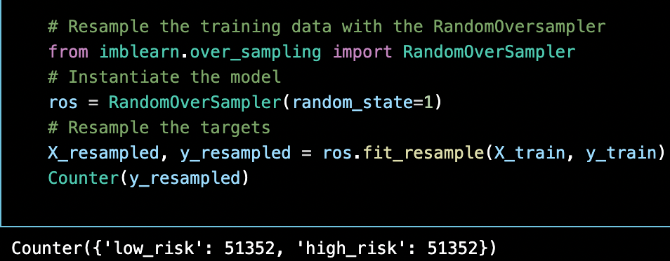
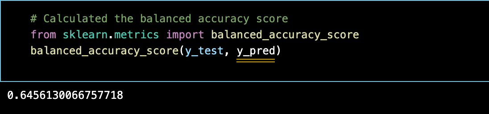
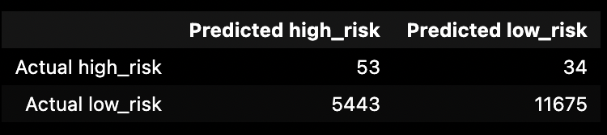
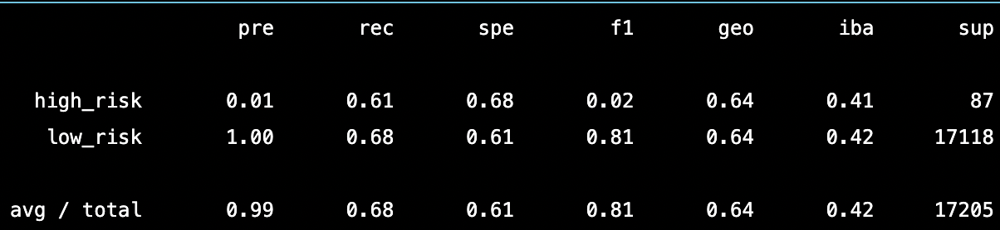
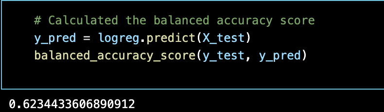

An analysis using Machine Learning algorithms to identify credit card risk using a dataset from LendingClub.

# Overview

The purpose of this analysis is to utilize `Machine Learning` statistical algorithms to make predictions on credit risk borrowers. 

## Approach

 **Supervised Learning** using a free dataset from **LendingClub**, a P2P lending service company to evaluate and predict credit risk.F he data contains a labled outcome. Therefore, this is an example of **"Supervised Learning"**. 

- We use different `Machine Learning` techniques to train and evaluate the data with unbalanced classes. 
- The dataset from the **LendingClub** has an unbalanced classification problem due to the number of good loans outweighing the amount of risky loans. 
- In order balance out the classifications to allow for more meaningful predictions and improve the accuracy score, we needed to employ various `Machine Learning` algorithms to resample the data. 
- Algorithms used: `RandomOverSampler`, `SMOTE`, `ClusterCentroids`, `SMOTEENN`, `BalancedRandomForestClassifier`, and `EasyEnsembleClassifier`.

## Resampling Models to Predict Credit Risk

### Oversampling

**`RandomOverSampler Model`** randomly selects from the minority class and adds it to the training set until both classifications are equal. The results classified 51,366 records each as High Risk and Low Risk.

  * Balanced accuracy score: 64%.

  

  * The "High Risk" precision rate was `1%` with the recall at `66%`, giving this model an `F1 score of 2%`.
  * "Low Risk" had a `precision rate of 100%` and recall at `68`%`.  
  
  ### Confusion Matrix
  
  
  ### Imbalance Classfication Report
  

**`SMOTE (Synthetic Minority Oversampling Technique) Model`**, like `RandomOverSampler` increases the size of the minority class by creating new values based on the value of the closest neighbors to the minority class instead of random selection. 

  * The balanced accuracy score decreased slightly to `62%`.

  

  * Like `RandomOverSampler`, the "High Risk" precision rate was 1% with the recall degraded to 61% giving this model an F1 score of 2%.
  * "Low Risk" had a precision rate of 100% and an improved recall at 69%.  

### Confusion Matrix
  

### Imbalance Classfication Report
  

### Undersampling

**`ClusterCentroids Model`**, an algorithm that identifies clusters of the majority class to generate synthetic data points that are representative of the clusters. The model classified 260 records each as High Risk and Low Risk.

  * Balanced accuracy score was lower than the oversampling models at 62%.
  

  * The "High Risk" precision rate again was only at 1% with the recall at 69% giving this model an F1 score of 1%.
  * "Low Risk" had a precision rate of 100% and with a lower recall at 40% compared to the oversampling models.  

### Confusion Matrix
  

### Imbalance Classfication Report 
  

## SMOTEENN algorithm to Predict Credit Risk

### Combination Sampling

**`SMOTEENN (Synthetic Minority Oversampling Technique + Edited NearestNeighbors) Model`** combines aspects of both oversampling and undersampling. The model classified 51,351 records as High Risk and 46,389 as Low Risk.

  * The balanced accuracy score  to 62% when using a combined sampling model.

  

  * The "High Risk" precision rate did not improve was only 1%, however the recall increased to 70% giving this model an F1 score of 2%.
  * "Low Risk" still showed a precision rate of 100% with the recall at 54%.  
  
  

  

## Ensemble Classifiers to Predict Credit Risk

A comparison of `Random Balance Forrest Classifier`and `Easy Ensemble Classifier` `Machine Learning` models. The goal here is to reduce bias to predict credit risk. 

* The models classified `51,366` as High Risk and `246` as Low Risk.

**`BalancedRandomForestClassifier Model`**, two trees of the same size and equal size to the minority class are constructed to represent one for the majority class and one for the minority class. 

  * The balanced accuracy score increased to 78.9% for this model.

  

  * The "High Risk precision rate increased to 3% with the recall at 70% giving this model an F1 score of 6%.
  * "Low Risk" still had a precision rate of 100% with the recall at 87%.  
  * The top feature by importance was "total_rec_prncp" at 7.4% of the total.

  
  
  

   

**`EasyEnsembleClassifier Model`**, a set of classifiers where individual decisions are combined to classify new examples.

  * The balanced accuracy score increased to 93.2% with this model.

  

  * The "High Risk precision rate increased to 9% with the recall at 92% giving this model an F1 score of 16%.
  * "Low Risk" still had a precision rate of 100% with the recall now at 94%.  

  
  
  

# Results

- We use `Machine Learning` to resample the dataset using `Python` libraries: `scikit-learn` and `imbalanced-learn` evaluate the results and provide a comparison for our analysis. 

- The original dataset contained 115,675 loan applications in Q1 of 2019. We used the "loan status" to determine whether the application was considered "low" or "high" risk. Applications that had "current" as the "loan status" were classified as "low risk" and the remaining as "high risk". This reduced the dataset to 68,817 total applications with 99% classified as "low risk". 

- Using the 75/25% method to split the data for training vs. testing, 51,352 "low risk" and 260 "high risk" applications were categorized into the training set.   

# Summary

The `EasyEnsembleClassifer`  was the most accurate model. The model yielded an accuracy rate of `93.2%` and a `9%` precision rate when predicting "High Risk candidates. The sensitivity rate (aka recall) was also the highest at `92%` compared to the other models. The result for predicting "Low Risk" was also the highest with the sensitivity rate at `94%` and an `F1 score of 97%`. Therefore, if a model needed to be recommended to perform this type of analysis, then this one would be the clear choice.

**Ranking of models in descending order based on "High Risk" results:**
* `EasyEnsembleClassifer`: 93.2% accuracy, 9% precision, 92% recall, and 16% F1 Score
* `BalancedRandomForestClassifer`: 78.9% accuracy, 3% precision, 70% recall and 6% F1 Score
* `SMOTE`: 65.2% accuracy, 1% precision, 61% recall and 2% F1 Score
* `SMOTEENN`: 64.5% accuracy, 1% precision, 72% recall and 2% F1 Score
* `RandomOverSampler`: 64.0% accuracy, 1% precision, 66% recall and 2% F1 Score
* `ClusterCentroids`: 54.5% accuracy, 1% precision, 69% recall and 1% F1 Score

A side note that should be considered is that original dataset had 99% of the applications classified as "Low Risk" with only 1% of the data classified in the "High Risk" category. This may skew the results greatly as there is a risk that the `Machine Learning` algorithms are creating clusters drawing from too small of a dataset of actual "High Risk" applications. This margin of risk might not be something that banks would be comfortable accepting.

# Resources

* Dataset from LendingClub: [LoanStats_2019Q1](https://github.com/DevTrav/Credit_Risk_Analysis/blob/main/resources/LoanStats_2019Q1.csv)
